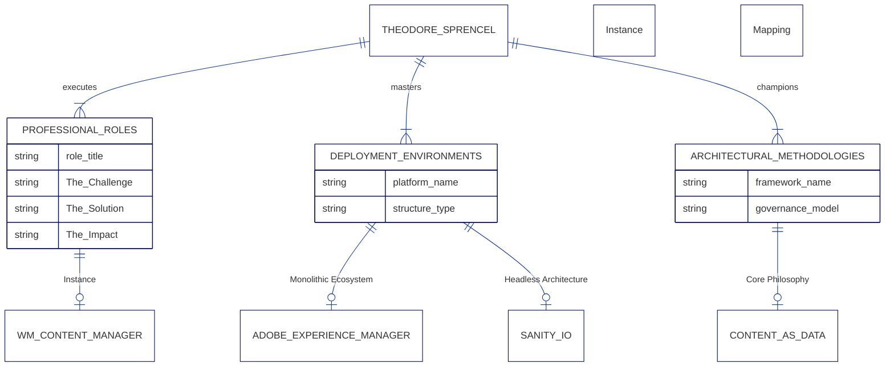

# Mermaid Diagram – Relational Résumé

My résumé as a relational diagram.

```mermaid
%%{init: {
  'theme': 'base',
  'themeVariables': {
    'primaryColor': '#ffffff',
    'primaryBorderColor': '#000B58',
    'lineColor': '#0e34a0',
    'textColor': '#000000',
    'fontFamily': 'Noto Sans'}
}}%%

erDiagram
    THEODORE_SPRENCEL ||--|{ PROFESSIONAL_ROLES : executes
    THEODORE_SPRENCEL ||--|{ DEPLOYMENT_ENVIRONMENTS : masters
    THEODORE_SPRENCEL ||--|{ ARCHITECTURAL_METHODOLOGIES : champions
    PROFESSIONAL_ROLES {
        string role_title
        string The_Challenge
        string The_Solution
        string The_Impact
    }
    DEPLOYMENT_ENVIRONMENTS {
        string platform_name
        string structure_type
    }
    ARCHITECTURAL_METHODOLOGIES {
        string framework_name
        string governance_model
    }
    Instance Mapping
    PROFESSIONAL_ROLES ||--o| WM_CONTENT_MANAGER : "Instance"
    DEPLOYMENT_ENVIRONMENTS ||--o| ADOBE_EXPERIENCE_MANAGER : "Monolithic Ecosystem"
    DEPLOYMENT_ENVIRONMENTS ||--o| SANITY_IO : "Headless Architecture"
    ARCHITECTURAL_METHODOLOGIES ||--o| CONTENT_AS_DATA : "Core Philosophy"
```